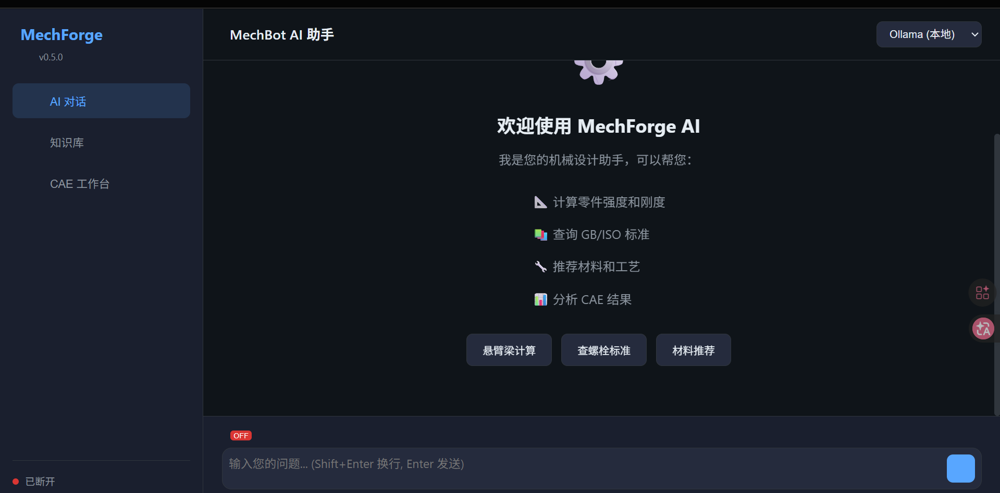
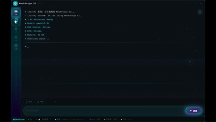

<div align="center">

# 🔧 MechForge AI


### 真正懂机械、敢说真话、能真算

**机械系苦逼在校生，用代码修补现实的缝隙 🤖**

<p>
  <a href="https://github.com/yd5768365-hue/mechforge/releases">
    
  </a>
  <a href="https://github.com/yd5768365-hue/mechforge/blob/main/LICENSE">
    
  </a>
  <a href="https://python.org">
    
  </a>
  <a href="https://github.com/yd5768365-hue/mechforge/actions/workflows/ci.yml">
    
  </a>
  <a href="https://github.com/yd5768365-hue/mechforge/stargazers">
    
  </a>
  <a href="https://github.com/yd5768365-hue/mechforge/issues">
    
  </a>
</p>

**[快速开始](#-快速开始) • [功能展示](#️-界面展示) • [文档中心](#-文档中心) • [贡献指南](#-贡献指南)**

</div>

---

## ✨ 功能亮点

<table>
<tr>
<td width="50%" valign="top">

### 🤖 AI 对话
多模型支持 • 流式响应 • MCP 工具调用 • RAG 集成

</td>
<td width="50%" valign="top">

### 📚 知识库
向量检索 • BM25 • 重排序 • 多格式支持

</td>
</tr>
<tr>
<td width="50%" valign="top">

### ⚙️ CAE 工作台
Gmsh 网格 • CalculiX 求解 • PyVista 可视化

</td>
<td width="50%" valign="top">

### 🖥️ 多端支持
CLI 终端 • GUI 桌面 • Web 浏览器 • Docker

</td>
</tr>
</table>

---

## 🛠️ 技术栈

<p align="center">
  
  
  
  
  
  
  
</p>

---

## 🖥️ 界面展示

### 1. AI 对话模式

<p align="center">
  
</p>

**启动命令**: `mechforge`

**相关文档**:
- [📖 使用指南](docs/USAGE.md) - AI 对话命令详解
- [⚙️ 配置](docs/CONFIG.md) - AI Provider 配置
- [🏗️ 架构](docs/ARCHITECTURE.md) - LLM 客户端架构
- [📄 开发日志](docs/GUI_AI_实现完成总结.md) - AI 对话实现历程

---

### 2. 知识库模式

<p align="center">
  
</p>

**启动命令**: `mechforge-k`

**相关文档**:
- [📖 使用指南](docs/USAGE.md) - 知识库检索命令
- [⚙️ 配置](docs/CONFIG.md) - RAG 和知识库配置
- [🏗️ 架构](docs/ARCHITECTURE.md) - RAG 引擎架构
- [📄 优化日志](docs/OPTIMIZATION_2026-03-16.md) - 模型缓存优化

---

### 3. CAE 工作台

<p align="center">
  
</p>

**启动命令**: `mechforge-work`

**相关文档**:
- [📖 使用指南](docs/USAGE.md) - CAE 工作台操作
- [⚙️ 配置](docs/CONFIG.md) - CAE 求解器配置
- [🏗️ 架构](docs/ARCHITECTURE.md) - CAE 引擎架构
- [📄 关于](docs/ABOUT.md) - CAE 模块介绍

---

### 4. Web 界面

<p align="center">
  
</p>

**启动命令**: `mechforge-web`

**相关文档**:
- [📖 使用指南](docs/USAGE.md) - Web 服务启动和使用
- [⚙️ 配置](docs/CONFIG.md) - Web 服务配置
- [🏗️ 架构](docs/ARCHITECTURE.md) - FastAPI 架构设计
- [📄 API 文档](docs/API.md) - Web API 接口说明

---

### 5. GUI 桌面应用

<p align="center">
  
</p>

**启动命令**: `mechforge-gui`

**相关文档**:
- [📖 使用指南](docs/USAGE.md) - GUI 桌面应用使用
- [⚙️ 配置](docs/CONFIG.md) - GUI 配置选项
- [🏗️ 架构](docs/ARCHITECTURE.md) - PyWebView 架构
- [📄 实现总结](docs/GUI_AI_实现完成总结.md) - GUI 开发历程
- [📄 优化日志](docs/OPTIMIZATION_2026-03-16.md) - 性能优化记录

---

## 🚀 快速开始

### 安装

```bash
# PyPI 安装
pip install mechforge-ai

# 完整安装
pip install mechforge-ai[all]

# 从源码安装
git clone https://github.com/yd5768365-hue/mechforge.git
cd mechforge
pip install -e ".[all]"
```

### 命令速查

| 命令 | 功能 | 说明 |
|------|------|------|
| `mechforge` | AI 对话 | 终端交互模式 |
| `mechforge-gui` | GUI 应用 | 桌面图形界面 |
| `mechforge-k` | 知识库 | RAG 检索模式 |
| `mechforge-work` | CAE 工作台 | 有限元分析 |
| `mechforge-web` | Web 服务 | 浏览器访问 |
| `mechforge-model` | 模型管理 | Ollama/GGUF |

👉 **详细安装指南**: [INSTALL.md](INSTALL.md)

---

## 📚 文档中心

### 核心文档

| 文档 | 说明 |
|------|------|
| [README.md](README.md) | 项目介绍 |
| [INSTALL.md](INSTALL.md) | 安装指南 |
| [USAGE.md](docs/USAGE.md) | 使用指南 |
| [CONFIG.md](docs/CONFIG.md) | 配置说明 |
| [API.md](docs/API.md) | API 文档 |
| [ARCHITECTURE.md](docs/ARCHITECTURE.md) | 架构文档 |
| [ABOUT.md](docs/ABOUT.md) | 关于开发者 |

### 其他文档

| 文档 | 说明 |
|------|------|
| [CHANGELOG.md](开发日志/CHANGELOG.md) | 更新日志 |
| [DEV_LOG.md](开发日志/DEV_LOG.md) | 开发日志 |
| [DOCKER.md](docs/DOCKER.md) | Docker 部署 |

### 模块文档

| 模块 | 说明 |
|------|------|
| [mechforge_ai/](mechforge_ai/) | AI 对话模块 |
| [mechforge_knowledge/](mechforge_knowledge/) | 知识库模块 |
| [mechforge_work/](mechforge_work/) | CAE 工作台模块 |
| [mechforge_web/](mechforge_web/) | Web 服务模块 |
| [gui_pywebview/](gui_pywebview/) | GUI 桌面应用 |
| [mechforge_core/](mechforge_core/) | 核心模块 |

---

## 📦 Docker 部署

```bash
# Docker Compose (推荐)
docker-compose --profile full up -d

# 单独模式
docker-compose --profile ai up -d     # AI 对话
docker-compose --profile rag up -d    # 知识库
docker-compose --profile work up -d   # CAE 工作台
docker-compose --profile web up -d    # Web 服务
```

| 镜像 | 大小 | 描述 |
|------|------|------|
| `ghcr.io/yd5768365-hue/mechforge:latest` | ~800MB | 完整版 |
| `ghcr.io/yd5768365-hue/mechforge-ai:latest` | ~200MB | AI 对话 |
| `ghcr.io/yd5768365-hue/mechforge-rag:latest` | ~500MB | 知识库 |
| `ghcr.io/yd5768365-hue/mechforge-work:latest` | ~400MB | CAE 工作台 |
| `ghcr.io/yd5768365-hue/mechforge-web:latest` | ~300MB | Web 服务 |

---

## 📂 项目结构

```
mechforge_ai/
├── mechforge_core/          # 核心模块 (配置、缓存、数据库、日志)
├── mechforge_ai/            # AI 对话模块
├── mechforge_knowledge/     # 知识库模块
├── mechforge_work/          # CAE 工作台模块
├── mechforge_web/           # Web 服务模块
├── gui_pywebview/           # GUI 桌面应用
├── mechforge_theme/         # 主题组件
├── docs/                    # 文档
├── 开发日志/                # 开发日志
├── tests/                   # 测试
└── examples/                # 示例
```

---

## 🤝 贡献指南

欢迎参与 MechForge AI 的开发！

### 如何贡献

1. **Fork 项目** - 点击右上角 Fork 按钮
2. **克隆仓库** - `git clone https://github.com/你的用户名/mechforge.git`
3. **创建分支** - `git checkout -b feature/你的功能名`
4. **提交更改** - `git commit -m "feat: 添加某某功能"`
5. **推送分支** - `git push origin feature/你的功能名`
6. **创建 PR** - 在 GitHub 上创建 Pull Request

### 开发规范

- **代码风格**: 使用 Black 格式化，Ruff 检查
- **类型注解**: 使用 MyPy 类型检查
- **提交信息**: 遵循 [Conventional Commits](https://www.conventionalcommits.org/)

```bash
# 运行测试
pytest tests/

# 代码检查
ruff check .
black --check .
mypy mechforge_*/
```

---

## ❓ 常见问题

<details>
<summary><b>Q: 如何切换 AI 模型？</b></summary>

在 GUI 设置中选择提供商和模型，或编辑 `config.yaml`:

```yaml
provider:
  default: "ollama"
  ollama:
    model: "qwen2.5:3b"
```

</details>

<details>
<summary><b>Q: Ollama 连接失败怎么办？</b></summary>

1. 确认 Ollama 已安装: `ollama --version`
2. 启动服务: `ollama serve`
3. 下载模型: `ollama pull qwen2.5:3b`

</details>

<details>
<summary><b>Q: 如何添加知识库文件？</b></summary>

将 Markdown (.md)、PDF (.pdf)、TXT (.txt) 文件放入 `knowledge/` 目录，程序会自动加载。

</details>

<details>
<summary><b>Q: CAE 功能不可用？</b></summary>

安装 CAE 依赖: `pip install mechforge-ai[work]`

确保已安装 Gmsh 和 CalculiX。

</details>

---

## 📝 更新日志

### v0.4.0 (2026-03-15)

**新特性**:
- GUI 桌面应用科幻主题
- 知识库路径统一管理
- RAG 功能完整支持
- 反思引擎集成

**修复**:
- RAG 引擎启动延迟
- mechforge-work 入口点参数错误

👉 [查看完整更新日志](开发日志/CHANGELOG.md)

---

## 📞 联系方式

- **GitHub**: https://github.com/yd5768365-hue/mechforge
- **Issues**: [报告问题](https://github.com/yd5768365-hue/mechforge/issues)
- **Discussions**: [参与讨论](https://github.com/yd5768365-hue/mechforge/discussions)

---

<p align="center">
  <strong>如果这个项目对你有帮助，请给一个 ⭐ Star 支持一下！</strong>
</p>

<p align="center">
  Made with ❤️ for Mechanical Engineers
</p>